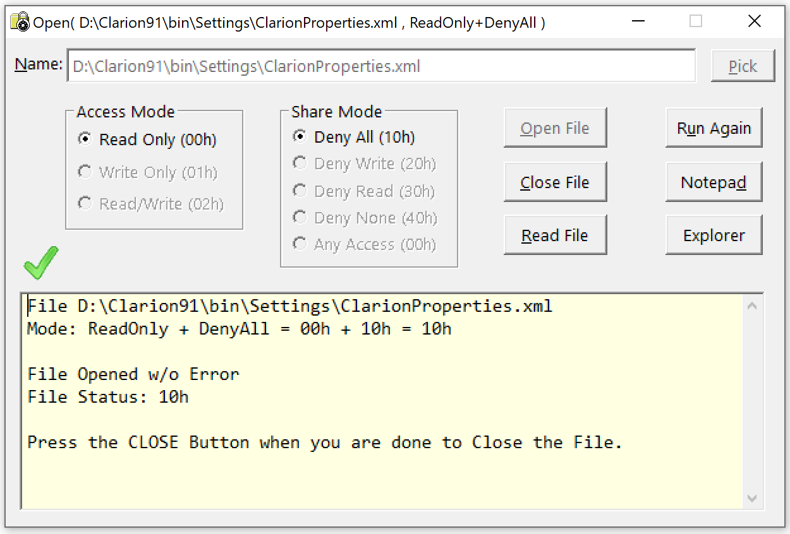
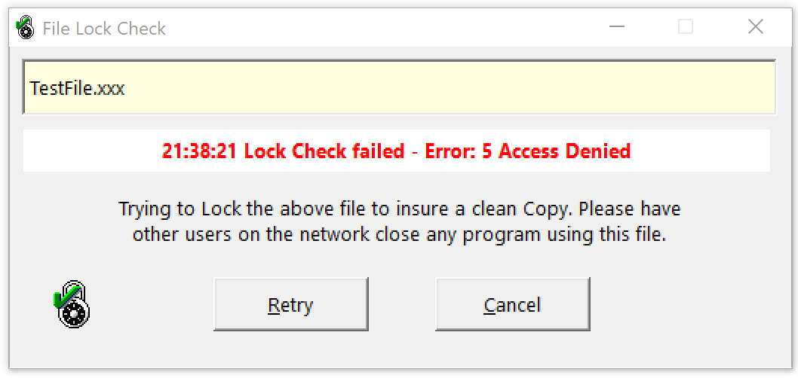
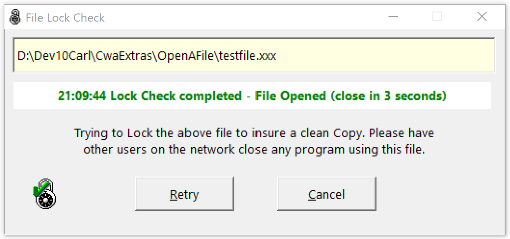

# OpenFileForTest 

Test your File code (Open, Copy, Remove) handles errors correctly when a program has a
 file locked or opened in an Access or Share mode not compatible with the mode your
 code requests. You can also use this tool to test when your program has a file open
 what modes can be used to open and read the file.



# FileLockCheck

FileLockCheck is intended for use in BAT files to check if a file is in use before doing a COPY
 or other operation that requires exclusive access ("Read Only + Deny All").
 It displays the window below to inform the user of the problem so they can
 try to get the file closed or cancel.
 The lock is retried every 3 seconds.
 Once the lock succeeds the message turns green and closes in 3 seconds.
 
Because it is intended for BAT file use it sets the ERRORLEVEL as follows:

| ErrorLevel | Reason |
| :--------: | ------ |
| 0 | Lock Succeeded |
| 1 | Lock Failed |
| 2 | File does not exist |

Typical BAT code would be:
```
REM Check if file can be locked then copy
FileLockCheck FileNameXYZ.TPS
IF NOT ERRORLEVEL 1  GOTO :CanCopy
ECHO Unable to Copy FileNameXYZ.TPS
IF ERRORLEVEL 2 ECHO File does not exist
PAUSE
GOTO :EOF

:CanCopy
COPY FileNameXYZ.TPS X:\Target
```





The easy way to test FileLockCheck is to use OpenFileForTest to "Open File" as Deny All then run FileLockCheck.
 Click "Close File" to see FileLockCheck turn green then close.